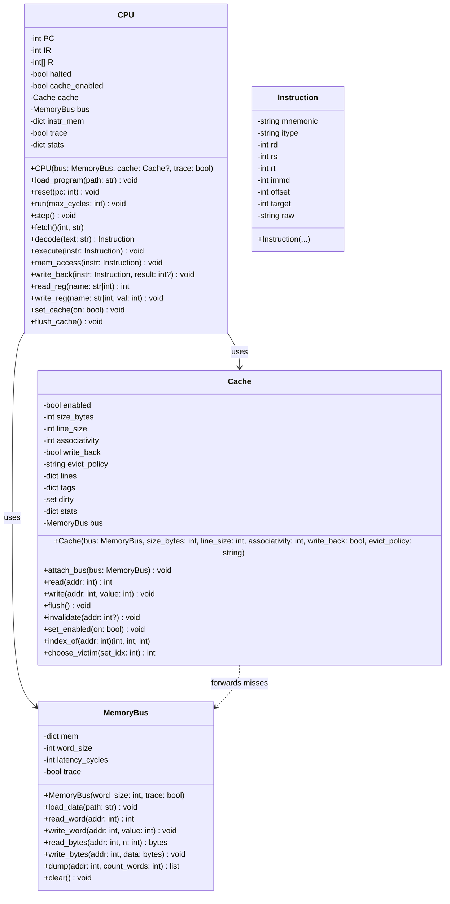
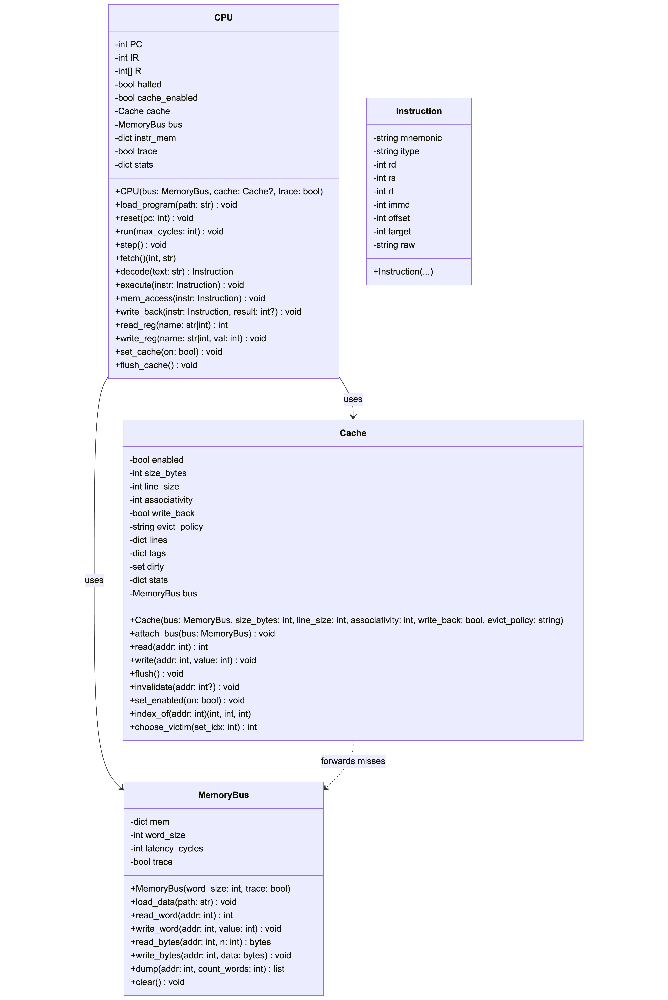

# CS104 CPU Simulator — Class Diagrams

[← Back to Project Management Index](../../README.md)

**Author:** Javier Ruiz Galan  
**Date:** September 2025  

---

## 1) CPU Class

### Purpose

Coordinates the fetch–decode–execute cycle, manages architectural state (register file, PC), interprets the ISA, and interacts with Cache and Memory Bus.

### Attributes

* `PC: int` — Program Counter (byte-addressed; increments by 4 for sequential flow)
* `IR: int | None` — Instruction Register (raw 32-bit value) or parsed token
* `R: list[int]` — General-purpose register file, length 32 (R0..R31), where `R0` is hardwired to 0; `R7` used as link register for `JAL`
* `halted: bool` — True when `HALT` executed
* `cache_enabled: bool` — Current cache on/off status
* `cache: Cache` — Reference to Cache instance
* `bus: MemoryBus` — Reference to MemoryBus instance
* `instr_mem: dict[int, int]` — Instruction memory (address → 32-bit encoded instruction or token)
* `trace: bool` — Emit stage-level console logs when True
* `stats: dict[str, int]` — e.g., `{"cycles": 0, "instr": 0, "branches": 0, "loads": 0, "stores": 0}`

### Methods

* `__init__(bus: MemoryBus, cache: Cache | None = None, trace: bool = True)`
* `load_program(path: str) -> None` — Parse `instruction_input.txt` (CSV format) into `instr_mem`
* `reset(pc: int = 0) -> None`
* `run(max_cycles: int = -1) -> None` — Repeatedly `step()` until `HALT` or cycle limit
* `step() -> None` — One full pipeline pass: Fetch → Decode → Execute → Mem → WriteBack
* **Pipeline Stages**

  * `fetch() -> tuple[int, str]` — Fetch raw instruction/token at `PC`, return `(addr, text)`
  * `decode(text: str) -> Instruction` — Parse mnemonic + operands to `Instruction`
  * `execute(instr: Instruction) -> None` — Perform ALU/branch/jump/cache ops
  * `mem_access(instr: Instruction) -> None` — Perform `LW`/`SW` via cache/bus
  * `write_back(instr: Instruction, result: int | None) -> None`
* **Helpers**

  * `read_reg(name: str | int) -> int` — Map `R0..R31` or int to value
  * `write_reg(name: str | int, val: int) -> None` — Ignores writes to `R0`
  * `sign_extend(immd: int, bits: int) -> int`
  * `branch(pc_next: int, offset: int) -> int` — Computes `PC' = (PC + 4) + offset * 4`
  * `set_cache(enabled: bool) -> None` — Implements `CACHE 0|1`
  * `flush_cache() -> None` — Implements `CACHE 2`
  * `log(stage: str, msg: str) -> None` — Conditional console logging when `trace`

### ISA Semantics Implemented

* `ADD  Rd, Rs, Rt` — `R[Rd] ← R[Rs] + R[Rt]`
* `ADDI Rt, Rs, immd` — `R[Rt] ← R[Rs] + sign_extend(immd)`
* `SUB  Rd, Rs, Rt` — `R[Rd] ← R[Rs] − R[Rt]`
* `SLT  Rd, Rs, Rt` — `R[Rd] ← 1 if R[Rs] < R[Rt] else 0`
* `BNE  Rs, Rt, offset` — If `R[Rs] != R[Rt]` then `PC ← (PC + 4) + offset * 4`
* `J    target` — `PC ← target * 4`
* `JAL  target` — `R7 ← PC + 4 ; PC ← target * 4`
* `LW   Rt, offset(Rs)` — `R[Rt] ← MEM[R[Rs] + offset]`
* `SW   Rt, offset(Rs)` — `MEM[R[Rs] + offset] ← R[Rt]`
* `CACHE code` — `0: off`, `1: on`, `2: flush`
* `HALT` — Stop execution

---

## 2) Cache Class

### Purpose

Optional, pluggable cache that fronts the Memory Bus. Supports enable/disable and flush commands from the CPU via the `CACHE` instruction.

### Attributes

* `enabled: bool` — Whether cache is active
* `size_bytes: int` — Total capacity
* `line_size: int` — Bytes per line (power of two)
* `associativity: int` — 1 = direct-mapped; N-way set associative
* `write_back: bool` — `True` = write-back, `False` = write-through
* `evict_policy: str` — e.g., `"LRU"` (others possible: `"FIFO"`)
* `lines: dict[tuple[int,int], CacheLine]` — Map `(set_idx, way)` → cache line
* `tags: dict[int, list[int | None]]` — Map set → tag array per way
* `dirty: set[tuple[int,int]]` — Tracks dirty lines (for write-back)
* `stats: dict[str, int]` — `{ "hits": 0, "misses": 0, "evictions": 0 }`
* `bus: MemoryBus` — Backing memory interface

### Methods

* `__init__(bus: MemoryBus, size_bytes: int = 1024, line_size: int = 16, associativity: int = 1, write_back: bool = True, evict_policy: str = "LRU")`
* `attach_bus(bus: MemoryBus) -> None`
* `read(addr: int) -> int` — Reads a **word** (4 bytes) at `addr`; fills on miss
* `write(addr: int, value: int) -> None` — Writes a **word** at `addr` honoring `write_back`/`write_through`
* `flush() -> None` — Write back all dirty lines and invalidate cache
* `invalidate(addr: int | None = None) -> None` — Invalidate one line or all
* `set_enabled(on: bool) -> None`
* `index_of(addr: int) -> tuple[int, int, int]` — `(tag, set_idx, block_offset)`
* `choose_victim(set_idx: int) -> int` — Way index according to policy

### Inner Data Structure: `CacheLine`

* `tag: int`
* `data: bytearray` — Length = `line_size`
* `valid: bool`
* `dirty: bool`
* `last_used: int` — For LRU

---

## 3) Memory Bus Class

### Purpose

Backs all memory operations. Provides a simple byte-addressable store plus helpers for word access. Loads initial data from `data_input.txt`.

### Attributes

* `mem: dict[int, int]` — Byte-addressable map (address → 0..255)
* `word_size: int` — Default 4 bytes
* `latency_cycles: int` — Simulated base latency for each access (for future use)
* `trace: bool` — Enable memory operation logs

### Methods

* `__init__(word_size: int = 4, trace: bool = False)`
* `load_data(path: str) -> None` — Parse `<ADDRESS>,<VALUE>` lines into memory as **word** values (little-endian by default)
* `read_word(addr: int) -> int` — Returns 32-bit int composed from 4 bytes
* `write_word(addr: int, value: int) -> None` — Writes 32-bit value to 4 bytes
* `read_bytes(addr: int, n: int) -> bytes`
* `write_bytes(addr: int, data: bytes) -> None`
* `dump(addr: int, count_words: int = 16) -> list[tuple[int, int]]` — Utility for debugging
* `clear() -> None`

---

## 4) Instruction Class (Parsing/IR)

### Purpose

Holds a parsed instruction and provides utilities for operand resolution.

### Attributes

* `mnemonic: str` — e.g., `"ADD"`, `"LW"`, `"CACHE"`
* `itype: str` — `"R" | "I" | "J" | "SYS"`
* `rd: int | None`
* `rs: int | None`
* `rt: int | None`
* `immd: int | None`
* `offset: int | None`
* `target: int | None`
* `raw: str` — Original instruction text (for tracing)

### Methods

* `__init__(...)`
* `__repr__() -> str`

---

## 5) Relationships & Notes

* CPU **uses** Cache (when `cache_enabled = True`) and **uses** MemoryBus for instruction & data fetches.
* Cache **forwards** misses to MemoryBus and **may** write back dirty lines on eviction/flush.
* All memory addresses are **byte-addressed**; instructions and data words are 4 bytes.
* Branch offsets are in **instructions**, not bytes; effective branch target = `(PC + 4) + offset * 4`.
* `instruction_input.txt` and `data_input.txt` are external inputs parsed at startup.

---

## 6) UML Diagram (Mermaid)

> Rendered automatically on GitHub/GitLab and most Markdown viewers.

---

## 7) Image

---

## 8) Notes for Implementation

* Ensure `R0` remains 0 by ignoring writes.
* All loads/stores must be word-aligned (raise/log an error otherwise).
* `CACHE` opcodes:

  * `CACHE 0` → `CPU.set_cache(False)`
  * `CACHE 1` → `CPU.set_cache(True)`
  * `CACHE 2` → `CPU.flush_cache()`
* Console output: each stage logs in `trace` mode, e.g., `FETCH @0x00000004: LW R1, 0(R0)`.
* For simplicity, instruction memory can be stored in `instr_mem` and fetched directly by `PC`/4 index; data memory flows through Cache/MemoryBus.
