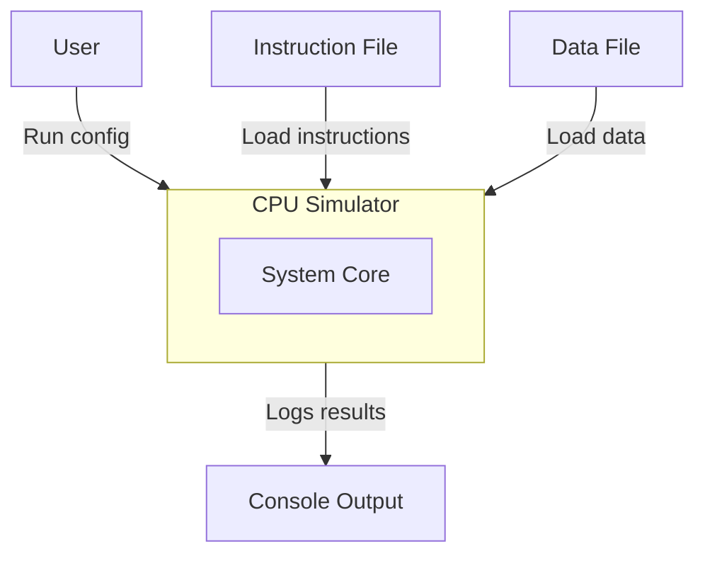

# CS104 CPU Simulator — Data Flow Diagram

[← Back to Project Management Index](../../README.md)

**Author:** Javier Ruiz Galan  
**Date:** September 2025  

---

## 1. Level 0 (Context Diagram)
At a glance, the **CPU Simulator** is a single system that:
- **Ingests** an instruction file and a data (memory) file,
- **Executes** instructions using a CPU + Cache + Memory Bus,
- **Emits** console logs/traces and final state.

## 2. Level 1 

