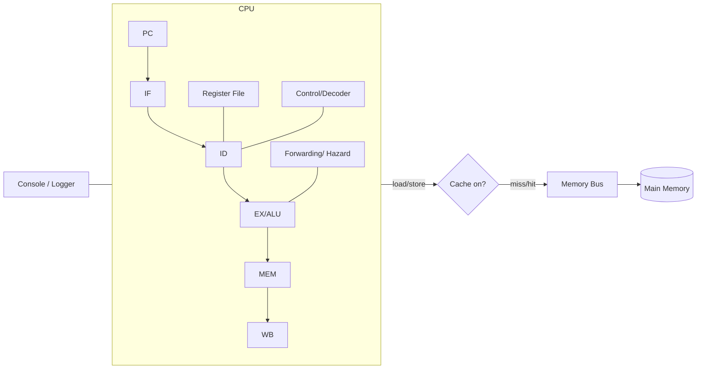
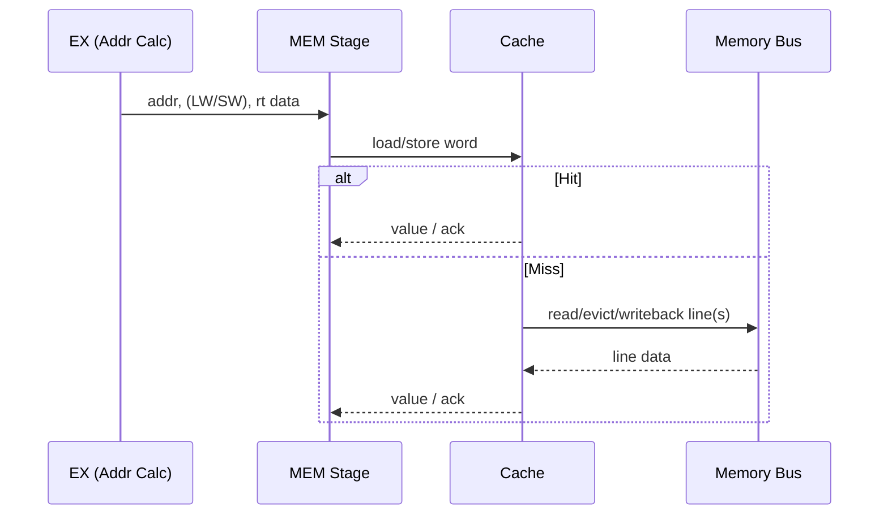
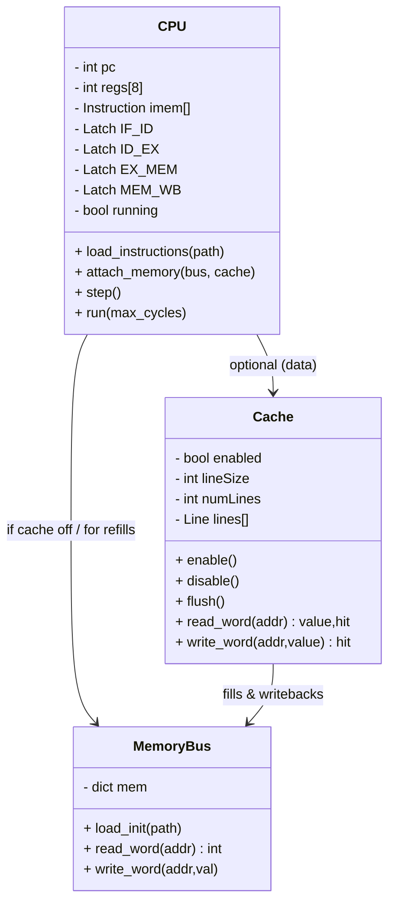

# CS104 CPU Simulator — System Architecture

[← Back to Project Management Index](../../README.md)

**Author:** Javier Ruiz Galan  
**Date:** September 2025  

---

## 1. Overview

### High-level description

A Python-based simulator of a MIPS-like single-core CPU with an optional direct-mapped data cache and a unified memory bus. The simulator:

* Loads instructions from `instruction_input.txt` and initial memory contents from `data_input.txt`.
* Executes a classic 5-stage pipeline (IF, ID, EX, MEM, WB) with simple hazard handling.
* Implements a minimal ISA: `ADD, ADDI, SUB, SLT, BNE, J, JAL, LW, SW, CACHE, HALT`.
* Logs each stage and memory/cache events to the console for traceability.

### Components

* **CPU**: Program Counter, Instruction Memory (loaded from file), Register File (R0–R7, with R7 as link), Control/Decoder, ALU, Pipeline registers, Hazard/Forwarding unit (minimal).
* **Cache (optional)**: Direct-mapped, write-back + write-allocate, flushable, enable/disable via `CACHE` instruction.
* **Memory Bus**: Backing store (word-addressable), initialized from `data_input.txt`, provides `read_word` / `write_word` to CPU or Cache.

#### Component diagram

---

## 2. Modules

### CPU

**Responsibilities**

* Manage fetch/decode/execute pipeline.
* Maintain PC, registers, and pipeline state.
* Decode and execute the supported ISA.
* Coordinate with Cache/Memory Bus for `LW/SW`.
* Handle control flow (`BNE`, `J`, `JAL`) and `HALT`.
* Emit verbose console logs of each pipeline stage.

**Key State**

* `pc: int` (byte address; 4-byte aligned).
* `regs: list[int]` length 8 (R0 hardwired to 0; R7 link for `JAL`).
* `imem: list[Instruction]` loaded from `instruction_input.txt`.
* Pipeline latches: `IF_ID`, `ID_EX`, `EX_MEM`, `MEM_WB`.
* `running: bool`.

**Public Interface (sketch)**

* `step() -> None` : advance one pipeline cycle; produce logs.
* `run(max_cycles: Optional[int])` : run to HALT or cycle limit.
* `load_instructions(path: str)`.
* `attach_memory(mem_bus: MemoryBus, cache: Optional[Cache])`.

**Decoding/Control**

* R-type: `ADD, SUB, SLT` → `rd, rs, rt`.
* I-type: `ADDI, BNE, LW, SW` → `rt, rs, imm`.
* J-type: `J, JAL` → `target`.
* `CACHE code` (0 off, 1 on, 2 flush), `HALT`.

**ALU Ops**

* `ADD/SUB/SLT` (signed compare), `ADD` also used for address calc and PC+offset.

**Hazards (minimal)**

* **Data hazards**: simple forwarding EX/MEM → EX and MEM/WB → EX; single-cycle stall on load-use when needed.
* **Control hazards**: resolve in ID for `J/JAL`, in EX for `BNE`; flush younger stages on taken branch/jump.

**Console Output**

* Per cycle: contents of each stage, register writes, memory ops, cache hits/misses, PC updates, pipeline flushes/stalls.

---

### Cache

**Purpose**

* Optional layer between CPU and Memory Bus for data (`LW/SW`). Controlled via `CACHE` instruction.

**Policy (configurable via constructor)**

* Mapping: direct-mapped.
* Line size: default 16 bytes (4 words).
* Lines: e.g., 64 (total 1 KB); feel free to parameterize.
* Write policy: write-back + write-allocate.
* Replacement: trivial (direct-mapped).
* States per line: `valid`, `dirty`, `tag`, `data[words]`.

**Interface**

* `read_word(addr: int) -> (value:int, hit:bool)`
* `write_word(addr: int, value:int) -> hit:bool`
* `enable() / disable()` (disabling bypasses cache; dirty lines write-back on disable).
* `flush()` (write back all dirty, invalidate).

**Behavior**

* Hit: serve from line; on store set `dirty`.
* Miss: write back victim if dirty; fetch line from Memory Bus; then serve.

---

### Memory Bus

**Responsibilities**

* Word-granular read/write to backing memory.
* Load initial contents from `data_input.txt`.
* Provide a simple, deterministic timing model (1 cycle baseline; cache miss cost modeled by cache, not bus).

**State & Interface**

* `mem: dict[int, int]` mapping **byte addresses (aligned)** → 32-bit signed ints.
* `read_word(addr: int) -> int` (requires `addr % 4 == 0`).
* `write_word(addr: int, value: int) -> None`.
* `load_init(path: str)`.

**File Formats**

* `instruction_input.txt`: `OPCODE,ARG1,ARG2,...` (one per line).
* `data_input.txt`: `ADDRESS,VALUE` (decimal or `0x...`; one per line).

---

## 3. Data Flow

### Pipeline Stages

* **Fetch (IF)**
  Read instruction at `PC` from `imem`. Compute `PC+4`.
  On flush (taken control transfer), drop IF/ID contents.

* **Decode (ID)**
  Parse fields; read `rs, rt` from Register File; sign-extend `imm`; compute branch target `(PC+4)+imm*4`; generate control signals.
  `J/JAL` resolve here (set `PC = target*4`; write `R7 = PC_old+4` for `JAL`; flush younger stages).

* **Execute (EX)**
  ALU ops (`ADD, SUB, SLT, address calc`), and `BNE` compare.
  Forwarding applied; load-use stall inserted if needed.

* **Memory Access (MEM)**
  For `LW/SW`, go through Cache if enabled, else directly to Memory Bus.
  Cache reports hit/miss; on miss it fetches/writes back via bus.

* **Write Back (WB)**
  Commit to Register File (`rd/rt`), except `R0` remains zero.
  Log `REG[dst] ← value`.

#### Pipeline overview

### Control Flow

* **BNE rs, rt, offset**: compare in EX; if taken, set `PC=(PC+4)+offset*4`, flush IF/ID.
* **J target**: set `PC=target*4` in ID; flush IF.
* **JAL target**: `R7=PC+4`, `PC=target*4` in ID; flush IF.

### Memory Path (with cache on)

### File I/O & Initialization Flow

1. **Memory Bus** loads `data_input.txt` → populate addresses.
2. **CPU** loads `instruction_input.txt` → `imem`.
3. **CPU** attaches to Bus (and Cache if enabled) → `run()`.

---

## 4. Diagrams

### Detailed Component/Ports

### Example Timing (load-use hazard)

```mermaid
gantt
    title Load-Use Stall (1-cycle)
    dateFormat  X
    axisFormat  %L
    section IF
    LW    :a1, 0, 1
    ADD   :a2, 1, 1
    section ID
    LW    :b1, 1, 1
    ADD(stall) :b2, 2, 1
    section EX
    LW    :c1, 2, 1
    ADD   :c2, 3, 1
    section MEM
    LW    :d1, 3, 1
    section WB
    LW    :e1, 4, 1
```

---

### Notes & Decisions

* **Registers**: 8 general registers for simplicity; `R0=0`, `R7` used by `JAL`.
* **Alignment**: instruction addresses and data are 4-byte aligned.
* **Signed arithmetic**: `ADD/SUB/ADDI/SLT` treat operands as signed 32-bit.
* **Cache control**: `CACHE 0` (off/bypass); `CACHE 1` (on); `CACHE 2` (flush).
* **Logging**: include cycle number, PC, stage contents, reg writes, cache hits/misses, stalls/flushes.
* **Safety**: out-of-range fetch → HALT with error; misaligned load/store → error log and HALT.
