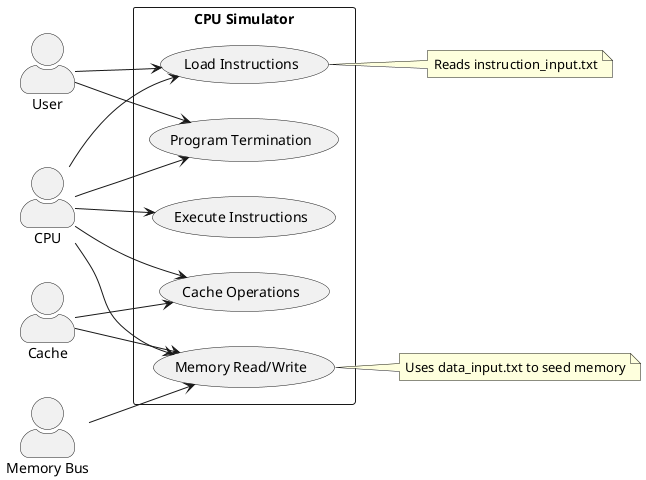

# CS104 CPU Simulator — Use Cases

[← Back to Project Management Index](../../README.md)

**Author:** Javier Ruiz Galan  
**Date:** September 2025  

> Inputs referenced: `instruction_input.txt` and `data_input.txt` (initial sample lines shown). 【24†instruction\_input.txt†L1-L5】【25†data\_input.txt†L1-L7】

## 1. Actors

* **CPU** – Fetches, decodes, and executes instructions.
* **Memory Bus** – Provides access to main memory for reads/writes.
* **Cache** – Improves performance by storing frequently accessed memory values.
* **User** – Provides input files and observes execution output.

## 2. Use Case Scenarios

### 2.1 Load Instructions

* **Actors involved:** CPU, User
* **Description:** User provides `instruction_input.txt`; CPU loads and parses instructions into instruction memory.

### 2.2 Execute Instructions

* **Actors involved:** CPU, Memory Bus, Cache
* **Description:** CPU executes instructions step-by-step (e.g., `ADDI`, `ADD`, `J`, `HALT`), modifying registers, PC, and invoking memory/cache operations.

### 2.3 Memory Read/Write

* **Actors involved:** CPU, Memory Bus, Cache
* **Description:** For load/store instructions (`LW`, `SW`), CPU requests memory access through the bus; cache may serve or forward to main memory initialized by `data_input.txt`.

### 2.4 Cache Operations

* **Actors involved:** CPU, Cache
* **Description:** Special `CACHE` instruction triggers operations (enable, disable, flush).

### 2.5 Program Termination

* **Actors involved:** CPU, User
* **Description:** `HALT` instruction terminates execution; CPU reports final state to the user.

## 3. Diagrams

### Mermaid (Use-Case Diagram)

```mermaid
%%{init: {'theme': 'default'}}%%
graph TD
  %% Actors
  U[([User])]
  C[([CPU])]
  MB[([Memory Bus])]
  CA[([Cache])]

  %% System boundary for "CPU Simulator"
  subgraph CPU_Simulator [CPU Simulator]
    UC1((Load Instructions))
    UC2((Execute Instructions))
    UC3((Memory Read/Write))
    UC4((Cache Operations))
    UC5((Program Termination))
  end

  %% Associations
  U --- UC1
  U --- UC5

  C --- UC1
  C --- UC2
  C --- UC3
  C --- UC4
  C --- UC5

  MB --- UC3
  CA --- UC3
  CA --- UC4

  %% Notes
  note right of UC1
    Reads instruction_input.txt
  end
  note right of UC3
    Uses data_input.txt to seed memory
  end
```

### PlantUML (Use-Case Diagram)


